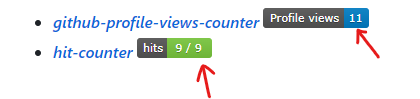

# page-visit-fake-boost
Fake boost your github profile page visit counts

# About 👍
Run this code to fake boost the visitor counter numbers displaying on github profile pages
Specifically for popular github profile visit counter:
- [***github-profile-views-counter***](https://github.com/antonkomarev/github-profile-views-counter)    
- [***hit-counter***](https://github.com/gjbae1212/hit-counter)   
- Almost anything that integrated with [camo](https://github.com/atmos/camo) that look similar as above

**Notes:** the code can take a while to finish if the number of increments of views is very large (above 1000)

# How this works 🤓
There are different types of page visits:
- Unique visitors
- Repeat visitors 
- Page visitors
- Page views per user
- etc...

***Page visitors*** is used in the counters listed above. This works because it only checks if certain page is visited, and the visitor can be from the same user.

However, **_Unique visitors_**, for example, will check the if the visitor is unique by looking at IP address or other forms of identification so that the number of views from the same user is not counted repeatedly. This is used in most websites, such as personal blogs and company websites  where page views are representative for popularity and critical for marketing. 

Therefore, this program only works on any view counters with _**Page visitors**_.

The logic of the code is very simple: since for _**Page visitors**_, the counter increases whenever a webpage is visited and a HTTP request is sent. 

So to "visit" this counter, we can fake a HTTP request and use python's `requests` package to send requests with corresponding url.

# Ethics & Purpose 🤞
Join this [*discussion*](https://github.com/Weq511762338/page-visit-fake-boost/discussions/1) on this repo if you are interested to share thoughts with others!

***Should we use this?***
> A billion fake profile views doesn't make you a very popular person, it makes you a person with a billion number in the counter. 

This is meant to be a learning opportunity/little trick.

**What it boosts is only a number, one's ego, but *NOT* one's ability or capability.**

*Plus, this doesn't work for most other authoritative website. Learn how this actually works in [**How this works**](#how-this-works) section below

# Usage 💻
1. Clone this repository
2. Copy the link of the page after clicking on the displaying counter
3. Run the python script `count-booster.py`
4. Follow the instruction once the code is executed

